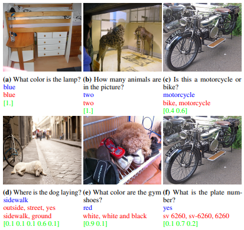
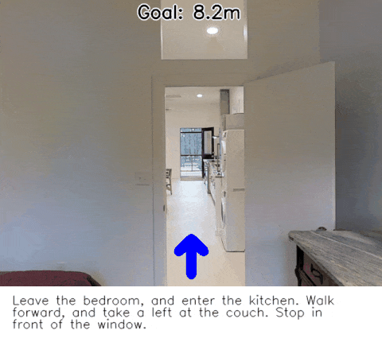
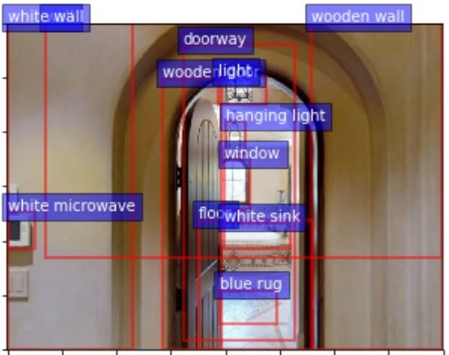
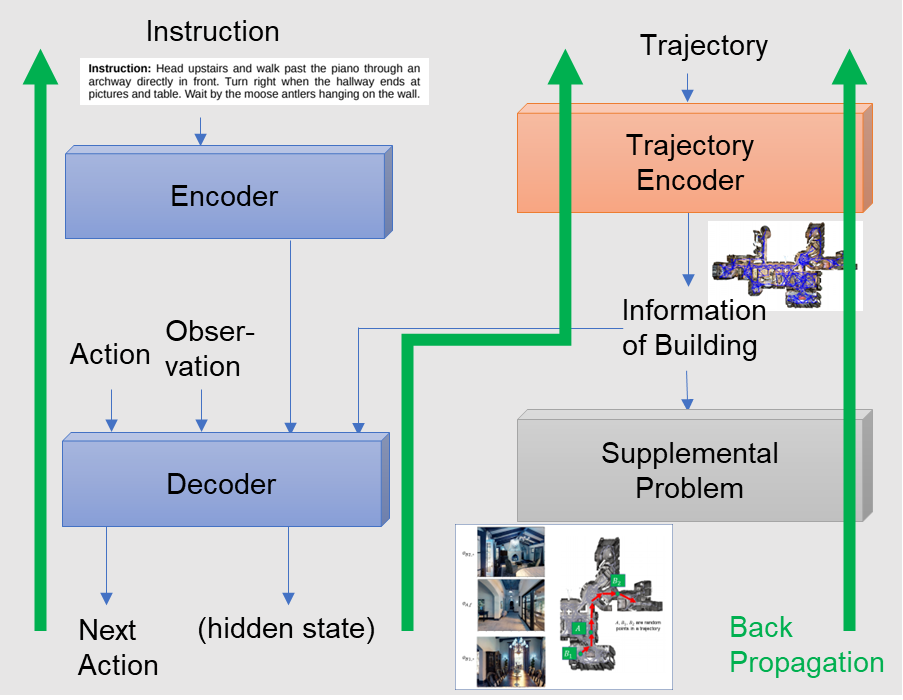
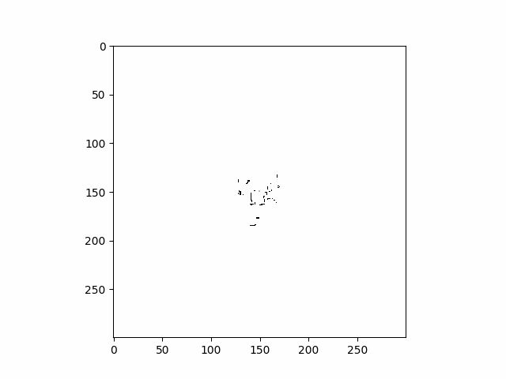
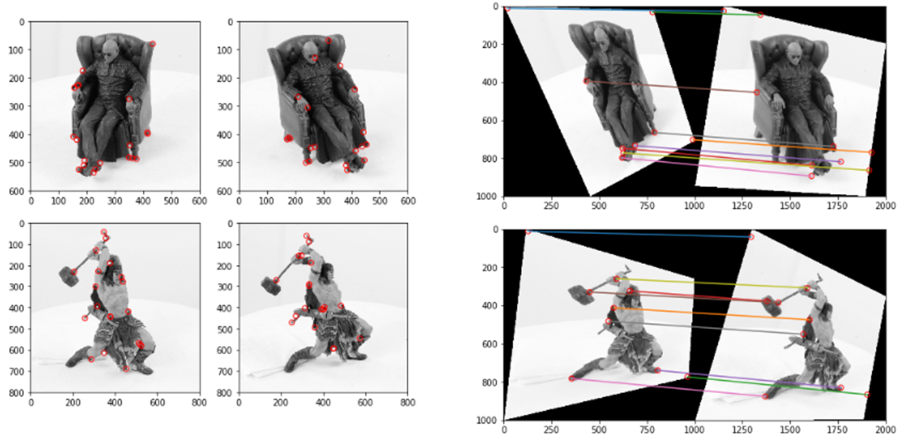
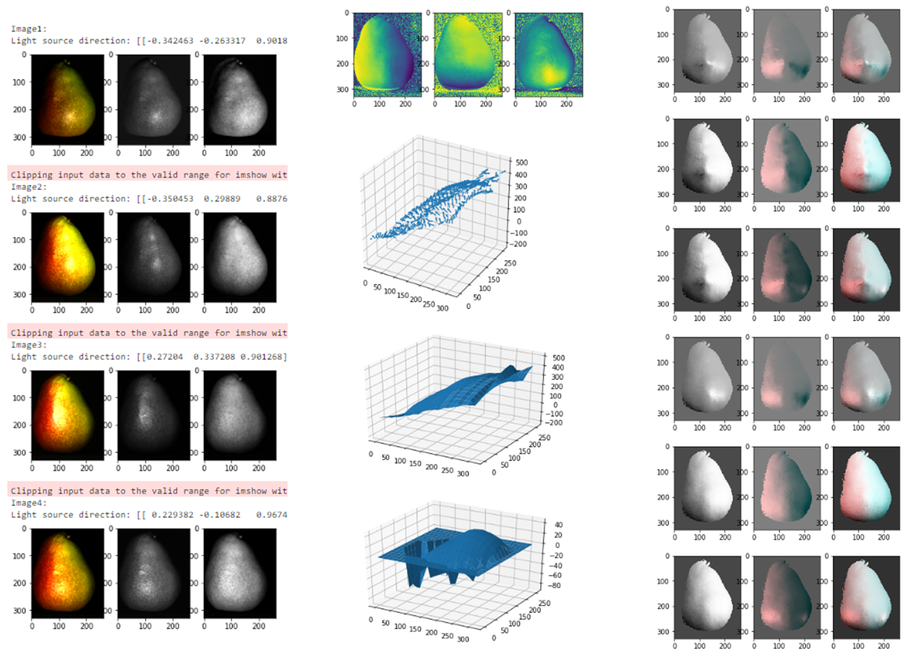
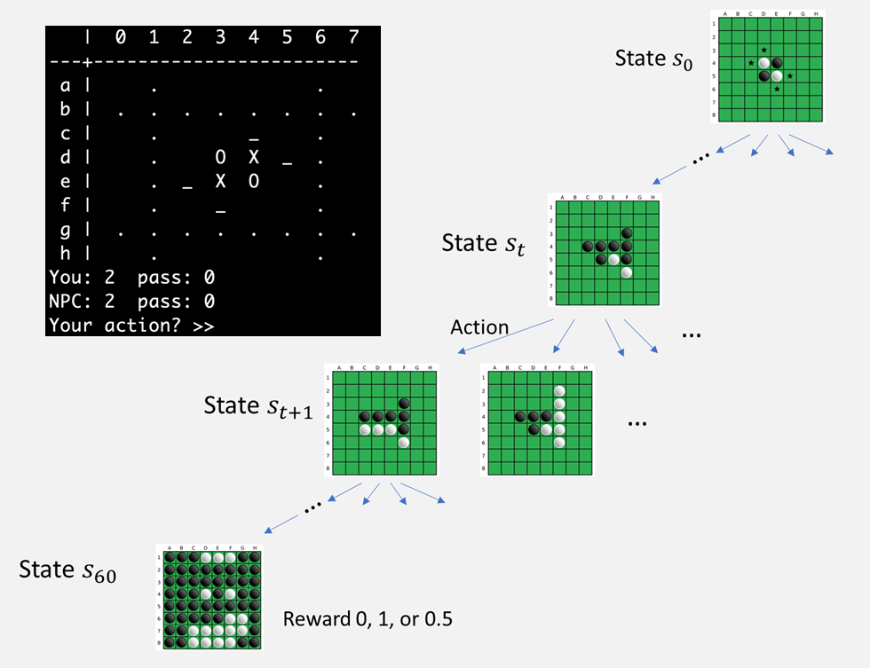

Fueled by a passion for math and computer science, I've tackled diverse projects in machine learning, computer vision, algorithms, and programming. Here are some highlights from my work in computer vision, followed by lower-level programming projects like compilers:

| Highlights from My Projects | |
|-|-|
| **Vision Question Answering (VQA)**   VQA is a task in computer vision that involves answering questions about an image. My work focused on Bottom-Up and Top-Down Attention Mechanism, optimizing object-level attention. The improved implementation achieved 63.61% accuracy, surpassing the original 63.15%. |  |
| **Vision Language Navigation (VLN)**   VLN is a task where agents learn to navigate following natural language instructions. In contrast to VQA, VLN model encodes texts and outputs actions while observing the new information. I explored a robot navigation in multi-floor buildings. |  |
| **Adaptive Zoom Mechanism for Vision Language Navition**   I integrated an Adaptive Zoom mechanism into VLN, enabling agents to locate large landmarks with wide-FOV vision and identify smaller or distant objects with magnified vision.  |  |
| **Trajectory Encoding for Vision Language Navition**   I designed a model that leverages pre-exploration information in 3D buildings, achieving a 45.8% success rate.    |  |
| **Simultaneous Localization And Mapping (SLAM)**   SLAM enables robotic mapping and navigation by constructing an environment map and tracking the robot's location simultaneously. I utilized a particle filter model to create a texture map from a differential-drive robot's two-minute activity in a building.  |  |
| **Corner Detection and Sparse Stereo Matching with Epipolar Geometry**   Employing epipolar geometry, the geometry of stereo vision, I detected and identified corresponding features in images taken from two distinct camera positions.  |  |
| **Photometric Stereo for Surface Reconstruction and Phong Illumination for Surface Rendering**   I used photometric stereo, a computer vision technique, to estimate surface normals under varying lighting conditions. The reconstructed surface was then rendered using the Phong reflection model, a computer graphics method for calculating local illumination. |  |

<!--
### Hi there 👋

| Monte-Carlo Tree Search for Othello  |  |

**s0sasaki/s0sasaki** is a ✨ _special_ ✨ repository because its `README.md` (this file) appears on your GitHub profile.

Here are some ideas to get you started:

- 🔭 I’m currently working on ...
- 🌱 I’m currently learning ...
- 👯 I’m looking to collaborate on ...
- 🤔 I’m looking for help with ...
- 💬 Ask me about ...
- 📫 How to reach me: ...
- 😄 Pronouns: ...
- ⚡ Fun fact: ...

-->
