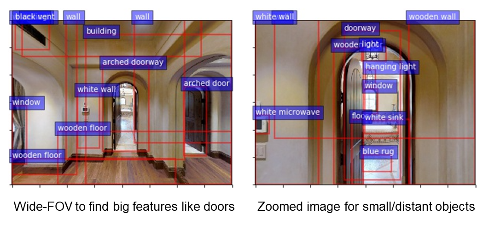

### Hi there 👋

I like math and computer science.

| Past Projects | |
|-|-|
| Vision Question Answering  |  |
| Vision Language Navigation  |  |
| Adaptive Zoom Mechanism for Vision Language Navition  |  |
| Trajectory Encoding for Vision Language Navition  |  |
| Monte-Carlo Tree Search for Othello  |  |
| Simultaneous Localization And Mapping for a Robot Moving in a Building |  |
| Corner Detection and Sparse Stereo Matching with Epipolar Geometry  |  |
| Photometric Stereo for Surface Reconstruction and Phong Illumination for Surface Rendering  |  |

<!--
**s0sasaki/s0sasaki** is a ✨ _special_ ✨ repository because its `README.md` (this file) appears on your GitHub profile.

Here are some ideas to get you started:

- 🔭 I’m currently working on ...
- 🌱 I’m currently learning ...
- 👯 I’m looking to collaborate on ...
- 🤔 I’m looking for help with ...
- 💬 Ask me about ...
- 📫 How to reach me: ...
- 😄 Pronouns: ...
- ⚡ Fun fact: ...

-->
